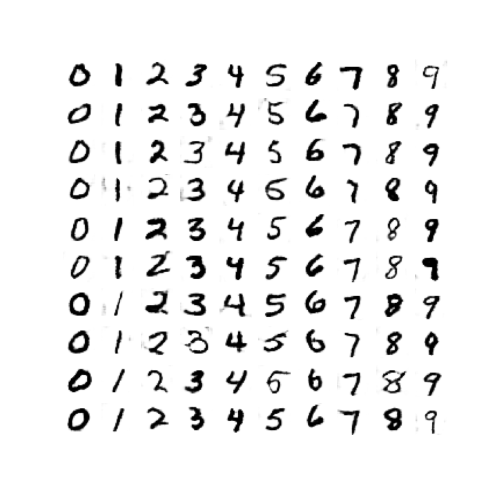

# MNIST_GANs

## Set up

Use the same environment, `ctlearn_tf2`, that is used for [CTGANs](https://github.com/sgh14/CTGANs).

## Usage

Simply run `main.py`.

## Results

Generated digits after 10 epochs of training:

